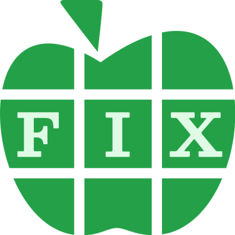

<h1 align="center">FIXAPL</h1>

  
<i>APL reimagined from the ground up with fixed-arity functions</i>
  
<i><a href="https://www.youtube.com/live/L7pttMExil4">Featured on the ArrayCast!</a></i>

FIXAPL is a simple programming language inspired by [APL](<https://en.wikipedia.org/wiki/APL_(programming_language)>), [BQN](https://mlochbaum.github.io/BQN/), and [Uiua](https://www.uiua.org/). (The rest of this document probably won't make much sense without at least a passing knowledge of each of these languages.)
I created it based on a few observations I made about APL and its family of languages, stemming from the fact that functions in this family can be called with either one argument or two.

1. Monadic/dyadic overloading of primitive functions can be confusing. There are certainly cases where it makes sense (for instance `-` for both subtraction and negation) but it's almost always pushed too far (think APL's `↑` meaning both Mix and Take, or BQN's `↕` meaning Range and Windows). This is a commonly-held opinion, and Marshall Lochbaum has written more about it in the context of BQN [here](https://mlochbaum.github.io/BQN/commentary/overload.html). The proposed solution is just reducing the amount of overloading, but at a certain point, why not do away with it altogether? Uiua gets away with it.

2. Modifiers (higher order functions) are far more powerful when they can behave differently depending on the arity of the functions they are passed, rather than only the arity of the resulting call. This is also mostly ripped from Uiua.

3. Fixed-arity functions provide a wonderful solution to the age-old train problem of how to divide a tacit expression of juxtaposed functions into fork, atop, or hook combinators. In [J](https://www.jsoftware.com/), the 2-train is the hook, the 3-train is the fork, and atop is handled seemingly as an afterthought with the cap `[:`. APL and BQN borrowed the fork but dropped the hook, with BQN keeping an equivalent to the cap. In [Kap](https://kapdemo.dhsdevelopments.com/), all functions in a train are combined as atops, and forks are declared explicitly, not the other way around.

   With fixed-arity functions, there's an obvious solution. Breaking all trains of the same length into the same structure regardless of what those functions are is about the best those languages can do, but having fixed-arity provides more context for more useful parsing. If a function is dyadic, apply it like a fork (or a hook, if applicable). If a function is monadic, apply it as atop. This even allows trains to have a value rather than a function as their rightmost tine (`-1` is a monadic function to subtract one), unlike other languages.

   A similar idea to this has been implemented in the language [Jelly](https://github.com/DennisMitchell/jellylanguage), though FIXAPL takes a pretty different approach.

You can try FIXAPL in an online REPL at https://fixapl.netlify.app. There are a few examples in the [`examples`](./examples) directory.

## Syntax

FIXAPL's arrays are multidimensional and follow a model based\* on BQN's, where multiple types exist and arrays are just one of them. The types, specifically, are number, character, array, function, and namespace.

Numbers can be written in decimal, and all numbers are double-precision floats. A negative sign is written as `¯`. Character literals are written with a character in-between apostrophes `'`. The character can be written with identical syntax to JavaScript strings. String literals (character lists) are enclosed in quotation marks `"`.

Array literals can be written with `[]` or `⟨⟩`, with elements separated by `,`. In the former syntax, the elements must all have the same shape, and the result is multidimensional, built using arrays as major cells. In the latter syntax, the elements are just assembled into a list. Lists can also be created with the stranding character `‿`, which can be put between elements as a shorthand for the angled bracket syntax.

FIXAPL expressions run from right to left. Expressions can be grouped with parentheses. Dyadic function calls come in the infix position (`⍺+⍵`) and monadic function calls come in the prefix position (`¬⍵`). Functions can be passed to higher-order functions (known as modifiers) in the opposite direction—dyadic modifiers come infix (`+⟜-`) while monadic modifiers come postfix (`+/`). Modifiers have greater operator precedence than functions, and modifiers are left-associative, while functions are right-associative.

Functions can be written with [dfn](https://en.wikipedia.org/wiki/Direct_function) syntax, where `{}` encloses the function body, the right argument is `⍵`, and the left argument is `⍺`. If only `⍵` is present, the function is monadic, if `⍺` is present, the function is dyadic, and if neither are they work like parentheses, with the only difference being that they introduce a scope.

Functions can also be written with a tacit/point-free syntax by writing expressions where functions have missing arguments. The arguments are filled in by the following rules:

1. If the rightmost part of an expression is a monadic function, its argument is the right input.
2. If the rightmost part of an expression is a dyadic function, its arguments are the two inputs.
3. A dyadic function with another function directly to its left forms a fork. The function on the left is called with the input argument(s), and the result is passed as the left argument to the right function.
4. If the leftmost part of an expression is a dyadic function, the left argument to that function is the left input.

The arity of the resulting function is the greatest number of inputs required by any of these rules.

Functions can be passed to functions by using the `₀ subject` monadic modifier. The function which is modified enters the syntax position of a value. A function in the value position can be moved back to the function position with `₁ monad` or `₂ dyad`.

Each line can either have an expression or a binding. A binding is a line of the form `Identifier ← Expr`, where everything after the arrow is parsed as one expression. Identifiers begin with an uppercase letter and afterwards can contain any latin letters or digits. The identifier can later be referenced to get its value or function. Bindings can be used to define recursive functions by writing `←₁` or `←₂` (the subscripts format from `1` or `2`) to declare the function as monadic or dyadic. Bindings are global.

There are also local variables, which take the form `Var↤` which is parsed as a monadic function which takes a value and assigns it to `Var`. These variables are always in the value syntax position, not the function position. Assigning a variable defines it in the current scope (bindings and dfns introduce scopes). The scope can be accessed as a value with `§` for the current scope, `§1` for the enclosing scope, `§2` for the next one, etc. with `§∞` always giving the global scope. Variables in a scope can be accessed with `Scope.Var` (which can also be the right-side of an assignment).

Line comments begin with `⍝`. Identifiers starting with `⎕` are I/O functions.

\* hehe get it, based

## Function List

### pervasive comparison funtions

**`= equal`, `≠ not equal`**:  
checking equality/inequality of values. functions always count as inequal.

**`> greater than`, `greater or equal`, `< less than`, `≤ less or equal`**:  
comparing values. characters are greater than numbers. comparing functions or namespaces raise errors.

**`↥ maximum`, `↧ minimum`**:  
return the greater or lesser of two values.

### monadic pervasive functions

**`¬ not`**:  
returns `1-⍵`. errors on non-numeric arguments.

**`¯ negate`**:  
returns `0-⍵` for numeric arguments, swaps case for character arguments.

**`± sign`**:  
returns the sign of `⍵` for numeric arguments, for character arguments it returns 1 for uppercase, -1 for lowercase, 0 otherwise.

**`⌵ absolute value`**:  
returns the absolute value of `⍵` for numeric arguments, returns uppercased version for character arguments.

**`√ square root`**:  
returns the square root of `⍵`, erroring on non-numeric arguments.

**`⌊ floor`, `⁅ round`, `⌈ ceiling`**:  
rounding down, up, or to the nearest integer, erroring on non-numeric arguments.

**`? roll`**:  
returns a random integer from `[0,⍵]` for `⍵>0`, returns a random float from `[0,1)` for `⍵=0`, errors for negative or non-integer input.

### dyadic pervasive functions

**`+ add`, `- subtract`, `× multiply`, `÷ divide`**:  
self-explanatory for numbers. a character can be added to a number, a number can be subtracted from a character, a character can be subtracted from a character.

**`| modulo`**:  
returns the remainder after dividing `⍵` by `⍺`.

**`* power`, `⍟ logarithm`**:  
`⍺*⍵` is `⍺``⍵`, `⍺⍟⍵` is log`⍺` `⍵`.

### monadic array functions

**`⋈ reverse`**:  
reverse the cells of an array.

**`⍉ transpose`**:  
rotate the axes of an array, moving the first axis to the end.

**`⍳ index generator`**:  
if `⍵` is a nonnegative integer, gives a list of integers from zero up to `⍵-1`. if `⍵` is a list of nonnegative integers, returns an array of shape `⍵` where each element is a list corresponding to its multidimensional index.

**`⧻ length`**:  
if `⍵` is an array of rank > 0, returns the length of its first axis, otherwise returns 1.

**`△ shape`**:  
if `⍵` is an array, returns its shape, otherwise returns `⟨⟩`.

**`▽ flat`**:  
if `⍵` is an array, returns a list of all its elements, otherwise returns `⍵` enclosed in a list.

**`□ enclose`**:  
returns `⍵` enclosed in a rank zero array.

**`⋄ enlist`**:  
returns `⍵` enclosed in a list.

**`⊡ merge`**:  
if `⍵` is an array, returns an array of its elements which must all have the same shape

### I/O functions

**`⎕Print`**:  
print a string, returning that string.

**`⎕Prompt`**:  
print the given string, prompt for a line of input, return it.

**`⎕Sleep`**:  
sleep for the given number of seconds before returning the actual amount of time elapsed.

**`⎕Img`**:  
display an image. the image must be a number array. if rank 2, each number represents a pixel rendered as grayscale from 0 (black) to 1 (white). if rank 3, the last axis represents the pixels. if the last axis is length 2, each pixel is grayscale + alpha channel. if length 3, the numbers are R,G,B, all 0-1. if length 4, the numbers are R,G,B,A.

**`⎕Text`**:  
render text to an image array. `⍵` is the string to be rendered, and `⍺` contains options. if `⍺` is a positive number, it is the font-size. if it is a list, it must contain a positive number which is the font-size, and can optionally contain a string to specify the font family, and up to two arrays representing colors, where the first is the text color and the second is the background color.
